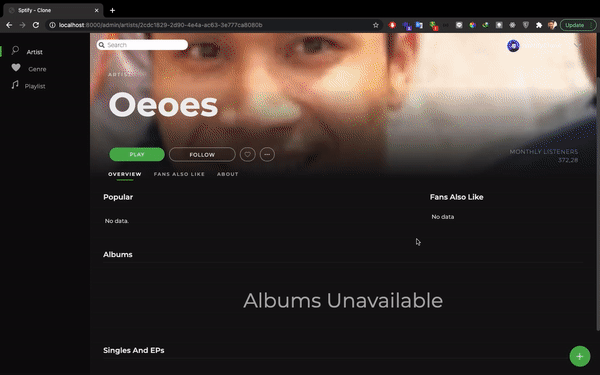
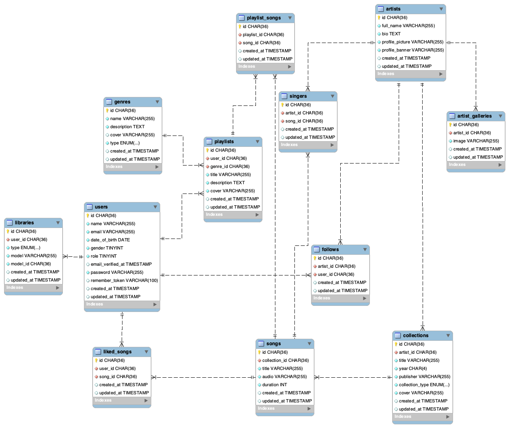

# Spotify Clone

I challenge my self to build music player like spotify (and it really is spotify lol). In this project i'm using Laravel with MySQL as backend, while for the frontend HTML, CSS, and Vanilla Js (Booo no framework 😚). The tools that I used to manage the development (i really love'em) those are: Trello (to write down my task), coda (to rewrite user stories of spotify), star UML/sometimes draw.io for modelling database.

Following are some previews of the app.

## Login/Register

## Admin

### Add Artist

### Add Album

### Add Playlist

## User
Play song, add to library, control audio include play/pause, next/prev, shuffle/loop, queue play, follow artist

## Database
